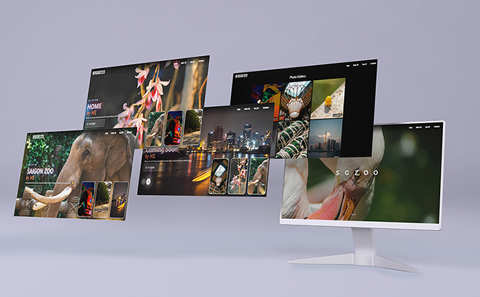
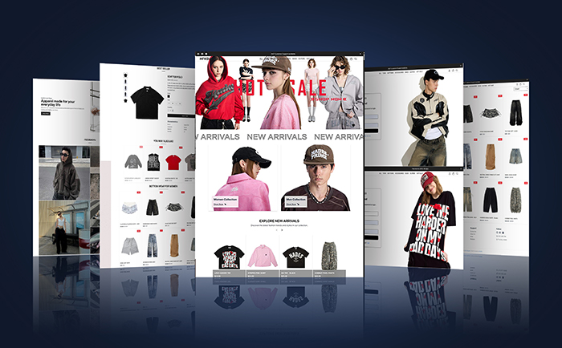

<!-- https://readme-typing-svg.demolab.com/demo/?font=Silkscreen&duration=2000&pause=800&background=080A2400&vCenter=true&lines=Xin+Chaooo+!!!%F0%9F%90%B0;Bao+dayyyyyy+%F0%9F%98%8E -->

<!-- visit counts -->

<tr>
  <td></td>
</tr>

<h2 align="center">👦🏻 About ME 💬</h2>

<!--table-->
<table style="border-collapse: collapse;" align="center">
  <!--row1-->
  <tr>
    <td style="vertical-align: top;" align="center">
      
    </td>
    <td>
      
⯈ 🎓 <em>I’m currently studying at HCMUS, striving to achieve my academic goals.</em>

⯈ 🧮 <em>My major is Mathematical Informatics (2020 - now), where I explore data and algorithms.</em>

⯈ 🐳 <em>Although slower than others because of an accident, I always keep trying and moving forward.</em>

⯈ ✨ <em>I dream of contributing to global projects that make a difference in people's lives.</em>

    </td>
  </tr>

  <!--row2-->
  <tr>
    <td>
      
⯈ 📸 <em>I love photography and using all photo editing tools.</em>

⯈ 💻 <em>Web development and coding always help me relax and unwind.</em>

⯈ 🌈 <em>A rainy day is perfect for getting everything done with a cozy vibe.</em>

⯈ 🗿 <em>I enjoy collecting collections just to satisfy my passion.</em>

    </td>
    <td style="vertical-align: top;" align="center">
      
    </td>
  </tr>

  <!--row3-->
  <tr>
    <td style="vertical-align: top;" align="center">
      
    </td>
    <td>
      
⯈ 🌸 <em>My future travel destination is Japan, the land of cherry blossoms.</em>

⯈ 🏡 <em>Striving for a fulfilling future with a happy and complete family.</em>

⯈ ⏳ <em>I must succeed before my parents grow old, to repay their sacrifices.</em>

⯈ 🚀 <em>Experiences create breakthroughs and define who we are.</em>

    </td>
  </tr>

  <!--row4-->
  <tr>
    <td style="vertical-align: top;" >
      
⯈ 🏖️ <em>The best journeys lead you not only to new places but also to a better version of yourself.</em>
  
      
⯈ 😺 <em>Happiness is not a destination, but the love and warmth we build along the way.</em>
  
      
⯈ 🥩 <em>Success is not just about speed, but about consistency and purpose.</em>
  
      
⯈ 🍭 <em>Every challenge is an opportunity in disguise—embrace it, grow, and soar.</em>

    </td>
    <td align="center">
    
    </td>
  </tr>
</table>
 

<h2 align="center">💻 Language and Tools ⚙️</h2>
<!-- Badges from https://github.com/Ileriayo/markdown-badges -->

 

 

<!--social media-->
<h2 align="center">👽 Where to find me 👽</h2>
 

  
  
  
  
  
  

 

<!--streaks-->
<!--https://streak-stats.demolab.com/demo/-->

<tr>
  <td></td>
  <td></td>
  <td></td>
</tr>

<!-- projects -->
<h2 align="center">🚀 My Projects 🚀</h2>

<table align="center">
  <tr>
    <td align="center" width="50%">
      <strong>📸 My Image Gallery</strong> 
      
       
      <a href="https://hfksue123.github.io/album-cua-bao/#/">🔗 Go to web</a> &nbsp;|&nbsp;
      <a href="https://github.com/hfksue123/album-cua-bao">📦 Code</a>
    </td>
    <td align="center" width="50%">
      <strong>☕ Coffee-Shop Frontend</strong> 
      
       
      <a href="https://hfksue123.github.io/Frontend-website-using-tailwindCSS-and-AOS/">🔗 Go to web</a> &nbsp;|&nbsp;
      <a href="https://github.com/hfksue123/Frontend-website-using-tailwindCSS-and-AOS">📦 Code</a>
    </td>
  </tr>
  <tr>
    <td align="center" width="50%">
      <strong>🛍️ Fullstack App Using Sanity</strong> 
      
       
      <a href="https://github.com/hfksue123/fullstack-sanity-app">📦 Code</a>
    </td>
    <td align="center" width="50%">
      <strong>👕 Fullstack Fashion App</strong> 
      
       
      <a href="https://fullstack-fashion-app.vercel.app/">🔗 Go to web</a> &nbsp;|&nbsp;
      <a href="https://github.com/hfksue123/fullstack-fashion-app">📦 Code</a>
    </td>
  </tr>
</table>

<!--quotes-->
 

<!--snake-->

<!--anime gifs-->

  
  

